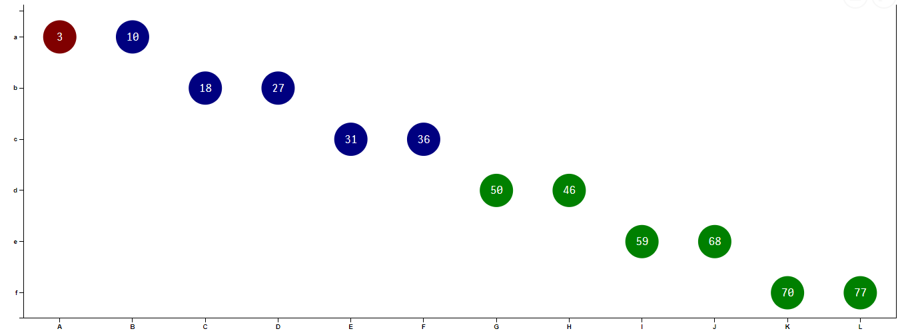
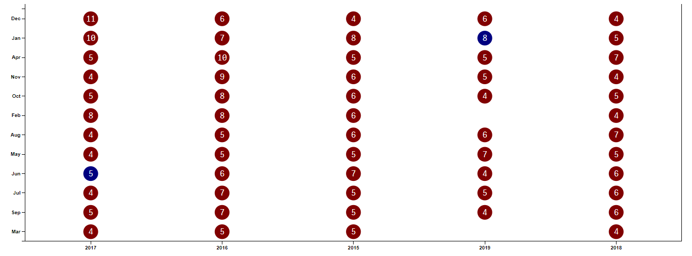
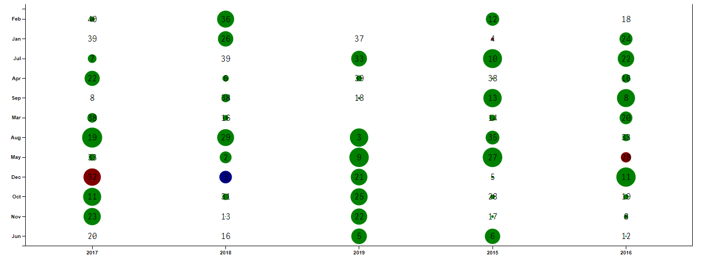

# Qlik Sense Extension - Grid Chart
##### This extension creates a grid chart similar to the one found in QlikView 11.

Implementation The grid chart takes 2 dimensions and 1 to 2 measures:

#### Dimension 1:
This dimension is for the x-axis.
#### Dimension 2:
This dimension is for the y-axis.
#### Measure 2:
This measure allows you to define a custom color & background color for bubble as per calculation
#### Measure 2 (optional):
This measure controls the bubble size.
#### Note :
 -1st Measure if for Transparency, BG for circle & Color is for value
 -2nd Measure is for circle size (Transparency, BG & Color will not work)

Link to <a href="https://github.com/skokenes/Qlik_Sense_Extension-GridChart" target="_blank">Orignal Page</a>.

